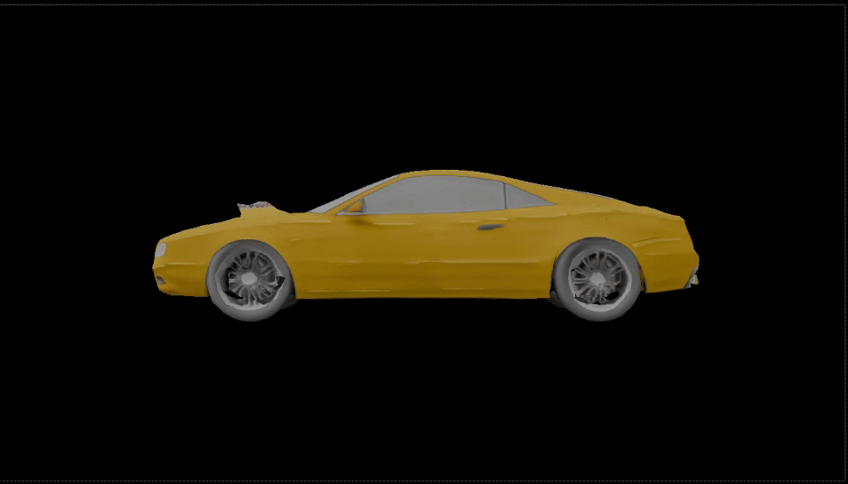
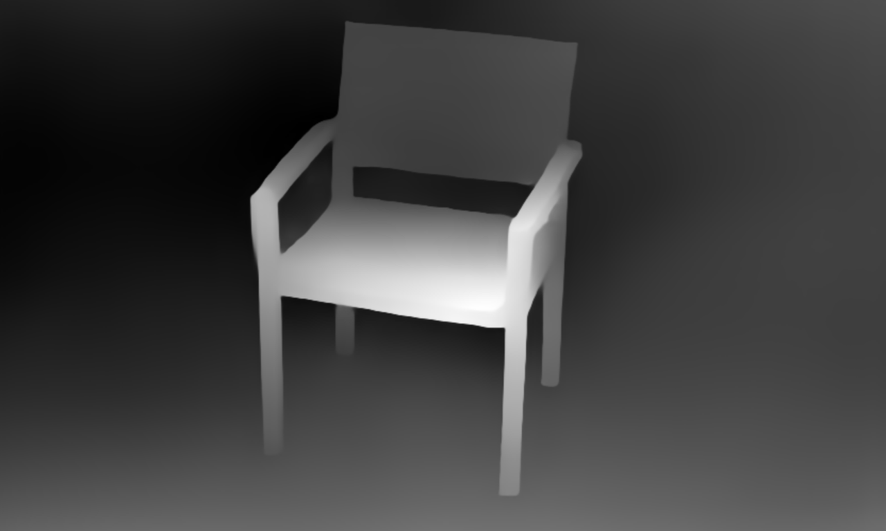

# ImageBind3D: Image as Binding Step for Controllable 3D Generation

### [Project Page](https://imagebind-3d.github.io/imagebind3d/)  | [GitHub](https://github.com/ImageBind-3D/imagebind3d) | [Paper]()

  

<figcaption style="text-align:justify; margin: 0 auto; display: table;">
We propose ImageBind3D, a simple but effective approach that can offer guidance in multiple forms to feed-forward 3D generative models, while not affecting the original network architectures, generation capacity and efficiency. Thanks to ImageBind3D, we can achieve more controllable outcomes, as opposed to the random results generated by GAN-based models or optimization-based techniques (e.g., Get3D and Dreamfusion). Furthermore, ImageBind3D can generate 3D object with composable guidance.
</figcaption>

  

    A red sedan with sports style  
    
     
  

  

  A yellow backreast chair
    
     
  

  

  A wooden office table
    
     
  

  

        
     
  

  

        
     
  

  

        
     
  

### Abstract

Recent advancements in 3D generation have garnered considerable interest due to their potential applications. Despite these advancements, the field faces persistent challenges in multi-conditional control, primarily due to the lack of paired datasets and the inherent complexity of 3D structures. To address these challenges, we introduce ImageBind3D, a novel framework for controllable 3D generation that integrates text, hand-drawn sketches, and depth maps to enhance user controllability. Our innovative contribution is the adoption of an inversion-align strategy, facilitating controllable 3D generation without requiring paired datasets. Firstly, utilizing GET3D as a baseline, our method innovates a 3D inversion technique that synchronizes 2D images with 3D shapes within the latent space of 3D GAN.  Subsequently, we leverage images as intermediaries to facilitate pseudo-pairing between the shapes and various modalities. Moreover, our multi-modal diffusion model design strategically aligns external control signals with the generative model's latent knowledge, enabling precise and controllable 3D generation. Extensive experiments validate that ImageBind3D surpasses existing state-of-the-art methods in both fidelity and controllability. Additionally, our approach can offer composable guidance for any feed-forward 3D generative models, significantly enhancing their controllability.

### Approach

<figcaption style="text-align: justify;">We design a two-phase method for multi-condition 3D object generation. Initially, a 3D inversion aligns images with 3D objects in latent space, generating pseudo-labels based on images. Subsequently, a multi-modal diffusion model facilitates the controlled generation of 3D objects. This technique ensures precise, controllable 3D outputs without large paired 3D datasets.</figcaption>
  

### Text-guidied 3D generation

<figcaption style="text-align: justify;">
We demonstrate the generative diversity and textual
guidance of our method. Each row employs the text prompt
with different samples of random noise as input.</figcaption>
  

  

     A pink car  
    
     
  

  

  A pink car 
    
     
  

  

  A yellow car
    
     
  

  

  A yellow car
    
     
  

### Composable guidance for controllable 3D generation

<figcaption style="text-align: justify;">
We show the multi-conditional control capabilities of our method. Each column takes the text prompt and additional
conditions as the model input.</figcaption>
  

 
  

   Input visual prompts 
    
     
  

  

      A red car
    
     
  

  

      A white car
    
     
  

  

    
     
  

  

    
     
  

  

    
     
  

  

  A purple car
 
    
     
  

  

    
     
  

  

   A backrest chair
 
    
     
  

  

    
     
  

